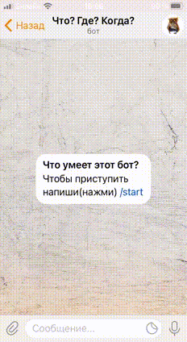

# Чатботы [Telegram](https://telegram.org/) и [VK](https://vk.com/) по игре Что? Где? Когда?

Чатботы для [Telegram](https://telegram.org/) и [Вконтакте](https://vk.com/) по 
игре Что? Где? Когда? с возможностью получить рандомный вопрос и ввести ответ, 
со статистикой правильных ответов пользователей.

 

[Наглядная демонстрация с возможностью самому написать ботам](#демонстрация)

## Настройки

* Необходимо зарегистрироваться в [Redislabs](https://redislabs.com/) - забрать 
  адрес базы данных вида `redis-13965.f18.us-east-4-9.wc1.cloud.redislabs.com:16635` и его пароль.
* Создать бота в Telegram через специального бота:
[@BotFather](https://telegram.me/BotFather), забрать API ключ и написать 
созданному боту.
* Забрать свой `chat_id` через [@userinfobot](https://telegram.me/userinfobot) - 
  необходим для получения логов (ошибки будут идти именно этому пользователю).
* Создать группу в [Вконтакте](https://vk.com/groups?tab=admin) и в настройках 
  группы -> "Работа с API" создать API-ключ с правами: "Управление группой", 
  "Отправка сообщений". Также не забудьте включить "сообщения группы" в настройках 
  -> сообщения.

### Переменные окружения

Создайте файл `.env` в корневой папке с кодом и запишите туда:
```
REDISLABS_ENDPOINT=АДРЕС_БД
REDIS_DB_PASS=ПАРОЛЬ_ВАШЕЙ_БД
TG_BOT_TOKEN=ВАШ_TELEGRAM_API_КЛЮЧ
TG_CHAT_ID=ВАШ_CHAT_ID
VK_BOT_TOKEN=ВАШ_API_КЛЮЧ_ВК
```

### Создание файла со своими вопрос-ответами

В корневой папке с кодом создайте папку `quiz-questions` - в неё необходимо 
поместить файл(ы) `.txt` с вопросами и ответами в формате:
```
Вопрос 1:
Ваш вопрос...

Ответ:
Ответ на вопрос 1


Вопрос 2:
Ваш вопрос...

Ответ:
Ответ на вопрос 2
...
```
- Запустите скрипт командой:
```
python get_questions.py
```


## Запуск

Для запуска у вас уже должен быть установлен [Python 3](https://www.python.org/downloads/release/python-379/).

- Скачайте код.
- Установите зависимости командой:
```
pip install -r requirements.txt
```
- Запустите скрипт командой: 
```
python tg_bot.py
```
```
python vk_bot.py
```


## Демонстрация

Вы можете протестировать работу данных ботов.

* Напишите в [Telegram @ChGK_OWL_bot](https://telegram.me/ChGK_OWL_bot).
* Напишите в [ВК группу](https://vk.com/im?sel=-205702477)
